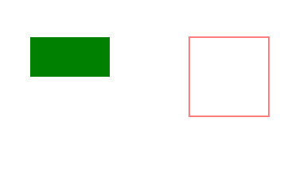
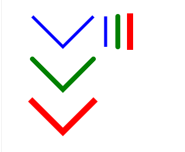

## canvas_tutorial
Canvas learning exercises

***

### canvas基本用法    
1. 在页面设置canvas元素，再获取canvas，再获取canvas 2d。
```html
  <canvas width="600" height="600" id="canvas">
    当前浏览器版本不支持canvas，请升级浏览器
  </canvas>
```
```typescript
const canvas = document.getElementById('canvas') as HTMLCanvasElement,
      ctx = canvas.getContext('2d');
```

2. 绘制路径: 1. beginPath方法告诉canvas开始绘制路径；2. moveTo方法从那开始绘制；3. lineTo方法绘制下一点；4. closePath方法关闭路径；5. strokeStyle方法设置描边的样式；6. stroke方法开始描边。fillStyle方法设置填充的样式，fill方法为填充。
   

```typescript
const canvas = document.getElementById('canvas') as HTMLCanvasElement,
      ctx = canvas.getContext('2d');

ctx!.beginPath(); // 开始绘制路径
ctx!.moveTo(100, 100); // 绘制起始点
ctx!.lineTo(200, 200); // 绘制到下一点
ctx!.lineTo(400, 180);
ctx!.lineTo(380, 50);

ctx!.closePath(); // 闭合路径

ctx!.strokeStyle = '#f00';  // 设置边框样式(颜色)
ctx!.stroke();  // 绘制
ctx!.fillStyle = 'orange'; // 设置填充样式(颜色)
ctx!.fill();  // 填充
```

3. 绘制矩形: 绘制实体矩形用fillRect，绘制之前先用fillStyle设置样式；绘制空心矩形用strokeRect，绘制之前用strokeStyle设置样式。   


```typescript
const canvas = document.getElementById('canvas') as HTMLCanvasElement,
      ctx = canvas.getContext('2d');

ctx!.fillStyle = 'green';
ctx!.fillRect(100, 100, 100, 50); // 绘制边框矩形：参数1，参数2为矩形的x,y座标值，参数3为长度，参数4为高度

ctx!.strokeStyle = 'red';
ctx!.strokeRect(300, 100, 100, 100); // 绘制实体矩形：参数1，参数2为矩形的x,y座标值，参数3为长度，参数4为高度
```

4. 圆弧: ctx.arc(x, y, r, sAngle, eAngle, counterClockwise)，x：x座标值，y: y座标值，r: 半径，sAngle: 起始角度，eAngle: 结束角度，counterclockwise: 可选值，规定应该逆时针还是顺时针绘图，false = 顺时针，true = 逆时针，默认“逆时针”。


```typescript
const canvas = document.getElementById('canvas') as HTMLCanvasElement,
      ctx = canvas.getContext('2d');

ctx!.beginPath();
/**
 * arc参数
 * x: x座标值,
 * y：y座标值,
 * r: 半径,
 * sAngle: 起始角度，单位用弧度
 * eAngle: 结束角度，单位用弧度
 * counterclockwise: 可选。规定应该逆时针还是顺时针绘图。False = 顺时针，true = 逆时针，默认“逆时针”。
 */
ctx!.arc(200, 200, 100, 0, 2 * Math.PI, false);
ctx!.stroke();
```

### 综合练习：使用canvas绘制随鼠标移动弹出彩色小球。
       

```typescript
(function () {
// 绘制炫彩小球
const canvas = document.getElementById('canvas') as HTMLCanvasElement,
      ctx = canvas.getContext('2d');

class Ball {
  color: string;
  r: number; // 小球的半径
  dx: number; // 小球在x轴的运动速度/帖
  dy: number; // 小球在y轴的运动速度/帖

  constructor(public x: number, public y: number) {
    this.color = this.getRandomColor();
    // 设置随机半径[1, 100]
    this.r = Math.floor(Math.random() * 100 + 1);
    this.dx = Math.floor(Math.random() * 10) - 5;
    this.dy = Math.floor(Math.random() * 10) - 5;
  }

  getRandomColor(): string {
    let allType = '0, 1, 2, 3, 4, 5, 6, 7, 8, 9, a, b, c, d, e, f';
    let allTypeArr = allType.replace(/\s?/g, '').split(',');
    let color = '#';

    for (let i = 0; i < 6; i++) {
      let idx = Math.floor(Math.random() * allTypeArr.length);
      color += allTypeArr[idx];
    }

    return color;
  }

  render(): void {
    ctx!.beginPath();
    ctx!.arc(this.x, this.y, this.r, 0, Math.PI * 2, false);
    ctx!.fillStyle = this.color;
    ctx!.fill();
  }

  update(): void {
    this.x += this.dx;
    this.y += this.dy;
    this.r -= 0.5;

    // 如果小球的半径小于0，从数组中删除
    if ( this.r <= 0 ) {
      this.remove();  
    } 
  }

  remove(): void {
    for (let i = 0; i < ballArr.length; i++) {
      if (ballArr[i] === this) {
        ballArr.splice(i, 1);
      }     
    }
  }
}

// 小球的数组
const ballArr: Ball[] = [];

// canvas设置鼠标监听
canvas.addEventListener('mousemove', (event) => {
  ballArr.push(new Ball(event.offsetX, event.offsetY));
});

setInterval(() => {
  ctx!.clearRect(0, 0, canvas.width, canvas.height);

  for (let i = 0; i < ballArr.length; i++) {
    ballArr[i].update();
    
    if (ballArr[i]) {
      ballArr[i].render();
    }
  }
}, 1000 / 60);

})()

```

### canvas基本用法    
* 绘制文字: ctx.font设置文字大小与字体，ctx.textAlign设置文字的对齐方式，ctx.fillText(text,x,y,maxWidth)，text：绘制文本，x：x座标值，y：座标值，maxWidth：可选。允许的最大文本宽度，以像素计。
   
```typescript
{
const canvas = document.getElementById('canvas') as HTMLCanvasElement,
      ctx = canvas.getContext('2d');

ctx!.font = '30px 微软雅黑'；
ctx!.fillText('您好，世界！'， 200， 100);
ctx!.textAlign = 'left';

ctx!.font = '30px 微软雅黑';
ctx!.textAlign = 'right';
ctx!.fillText('您好，世界！', 200, 150);
ctx!.font = '30px 微软雅黑';

ctx!.textAlign = 'center';
ctx!.fillText('您好，世界！', 200, 200);

ctx!.font = '30px 微软雅黑';
ctx!.textAlign = 'start';
ctx!.fillText('您好，世界！', 200, 250);

ctx!.font = '30px 微软雅黑';
ctx!.textAlign = 'end';
ctx!.fillText('您好，世界！', 200, 300);
}
``` 
* 绘制线条: 1. ctx.beginPath方法开始绘制线条；2. ctx.moveTo方法从那开始绘制；3. ctx.lineTo方法绘制到那一点；ctx.lineWidth设置线条宽度；4. ctx.lineCap设置 Canvas 2D API 指定如何绘制每一条线段末端的属性。有 3 个可能的值，分别是：butt, round and square。默认值是 butt；5. ctx.strokeStyle设置样式；6. ctx.stroke在canvas绘制。


```typescript
{
const canvas = document.getElementById('canvas') as HTMLCanvasElement,
      ctx = canvas.getContext('2d');

// 绘制第一条线
ctx!.beginPath();
ctx!.moveTo(50, 50);
ctx!.lineTo(100, 100);
ctx!.lineTo(150, 50);
ctx!.lineWidth = 5;
ctx!.lineCap = 'butt';
ctx!.strokeStyle = 'blue';
ctx!.stroke();

// 绘制第二条线
ctx!.beginPath();
ctx!.moveTo(50, 120);
ctx!.lineTo(100, 170);
ctx!.lineTo(150, 120);
ctx!.lineWidth = 8;
ctx!.lineCap = 'round';
ctx!.strokeStyle = 'green';
ctx!.stroke();

// 绘制第三条线
ctx!.beginPath();
ctx!.moveTo(50, 190);
ctx!.lineTo(100, 240);
ctx!.lineTo(150, 190);
ctx!.lineWidth = 10;
ctx!.lineCap = 'square';
ctx!.strokeStyle = 'red';
ctx!.stroke();

// lineCap
ctx!.beginPath();
ctx!.moveTo(170, 50);
ctx!.lineTo(170, 100);
ctx!.lineWidth = 5;
ctx!.lineCap = 'butt';
ctx!.strokeStyle = 'blue';
ctx!.stroke();

ctx!.beginPath();
ctx!.moveTo(190, 50);
ctx!.lineTo(190, 100);
ctx!.lineWidth = 8;
ctx!.lineCap = 'round';
ctx!.strokeStyle = 'green';
ctx!.stroke();

ctx!.beginPath();
ctx!.moveTo(210, 50);
ctx!.lineTo(210, 100);
ctx!.lineWidth = 10;
ctx!.lineCap = 'square';
ctx!.strokeStyle = 'red';
ctx!.stroke();
}

```
* 绘制虚线：1. ctx.setLineDash方法在填充线时使用虚线模式；2. ctx.strokeRect(x,y,width,height)绘制矩形。   
   

```typescript
const canvas = document.getElementById('canvas') as HTMLCanvasElement,
      ctx = canvas.getContext('2d');

canvas.width = document.documentElement.clientWidth - 30;
canvas.height = document.documentElement.clientHeight - 30;

ctx!.setLineDash([15, 15]);
ctx!.strokeRect(50, 50, 90, 90);
ctx!.setLineDash([15, 10, 2, 10]);
ctx!.strokeRect(200, 50, 90, 90);
```

* 绘制渐变色：绘制渐变色分为：线性渐变与径向渐变，线性渐变createLinearGradient(x0, y0, x1, y1), x0，y0为起始点座标，x1，y1为结束点座标。径向渐变createRadialGradient(x0,y0,r0,x1,y1,r1)，x0，y0径向起始点座标，r0为起始点半径，x1，y1径向起始点座标，r1结束点半径。addColorStop方法规定渐变对象中的种颜色和位置，addColorStop(stop, color)中参数stop: 介于0 -- 1之间，表示渐变中开始与结束之间的位置；color: 在stop位置显示的css颜色值。最后可用stoke或fill绘制。   


```typescript
const cavas = document.getElementById('canvas') as HTMLCanvasElement,
      ctx = cavans.getContext('2d');

const linerGradient = ctx!.createLinearGradient(10, 10, 100, 100);
linerGradient.addColorStop(0, 'red');
linerGradient.addColorStop(.5, 'blue');
linerGradient.addColorStop(.8, 'yellow');
linerGradient.addColorStop(1, 'green');
ctx!.fillStyle = linerGradient;
ctx!.fillRect(10, 10, 100, 100);

const radialGradient = ctx!.createRadialGradient(100, 300, 0, 100, 300, 100);
radialGradient.addColorStop(0, 'red');
radialGradient.addColorStop(1, 'purple');
ctx!.fillStyle = radialGradient;
ctx!.arc(100, 300, 100, 0, Math.PI * 2, false);
ctx!.fill();
```

* 绘制阴影：shadowOffsetX: 属性设置阴影的水平偏移量；shadowOffsetY：属性设置阴影的垂直偏移量；shadowBlur：设置阴影模糊度；shadowColor：设置或返回用于阴影的颜色。   
   

```typescript
const cavas = document.getElementById('canvas') as HTMLCanvasElement,
      ctx = cavans.getContext('2d');

ctx!.shadowOffsetX = 2; // 阴影左右偏离的距离
ctx!.shadowOffsetY = 2; // 阴影上下偏离的距离
ctx!.shadowBlur = 1; // 模糊状态
ctx!.shadowColor = 'pink'; // 阴影颜色
ctx!.font = '30px 宋体';
ctx!.fillStyle = 'grean';
ctx!.fillText('您好，世界！'， 100， 100);
```

### 综合练习：绘制圆形进度条：注意事项：结束角度的计算；文字位置的计算。
1. 结束角度的计算：(-90 + 360 * progress / 100) * Math.PI / 180; -90：为起始角度，360 * progress / 100计算新加的角度，乘于Math.PI / 180将角度转换成弧度。
2. 文字位置的计算：200 - txtWidth / 2, 200 + 10，x座标位置：圆的的一半再减去文字宽的一半，y座标位置：圆y座标加上文字高的一半，文字设置为20px，因此加10    
   

```typescript
{
function randColor() {
  const r = (Math.random() * 256) | 0;
  const g = (Math.random() * 256) | 0;
  const b = (Math.random() * 256) | 0;
  const opacity = 1;

  return `rgba(${r},${g},${b}, ${opacity})`;
}

function drawProgress(canvas: HTMLCanvasElement, progress: number) {
  const ctx = canvas.getContext('2d');

  ctx!.lineWidth = 10;
  ctx!.fillStyle = randColor();
  ctx!.strokeStyle = randColor();
  ctx!.font = '20px SimHei';
  ctx!.clearRect(0, 0, canvas.width, canvas.height);
  ctx!.beginPath();

  const startAngle = -Math.PI / 2;  // -90度
  const endAngle = (-90 + 360 * progress / 100) * Math.PI / 180; // 将角度转换成弧度

  ctx!.arc(200, 200, 60, startAngle, endAngle, false);
  ctx!.stroke();

  const txt = progress + '%',
        txtWidth = ctx!.measureText(txt).width; // 计算文字宽度
  
  ctx!.fillText(txt, 200 - txtWidth / 2, 200 + 10); // 将文字绘制在圆中心位置
}

const canvas = document.getElementById('canvas') as HTMLCanvasElement,
      ctx = canvas.getContext('2d');

let progress = 0;
const timer = setInterval(() => {
  progress += 5;

  drawProgress(canvas, progress);

  if (progress >= 100) {
    clearInterval(timer);
  }
}, 50);

}
```

* 绘制图像：drawImage方法，参数如图:    
   
ctx!.drawImage(image, 100, 100);    
ctx!.drawImage(image, 100, 100, 200, 200);    
ctx.drawImage(image, sx, sy, sWidth, sHeight, dx, dy, dWidth, dHeight);     
image: 绘制到上下文的元素。允许任何的画布图像源，例如：HTMLImageElement、SVGImageElement (en-US)、HTMLVideoElement、HTMLCanvasElement、ImageBitmap、OffscreenCanvas 或 VideoFrame (en-US)。   
sx：需要绘制到目标上下文中的，image 的矩形（裁剪）选择框的左上角 X 轴坐标。可以使用 3 参数或 5 参数语法来省略这个参数。   
sy: 需要绘制到目标上下文中的，image 的矩形（裁剪）选择框的左上角 Y 轴坐标。可以使用 3 参数或 5 参数语法来省略这个参数。
sWidth：需要绘制到目标上下文中的，image 的矩形（裁剪）选择框的宽度。如果不说明，整个矩形（裁剪）从坐标的 sx 和 sy 开始，到 image 的右下角结束。可以使用 3 参数或 5 参数语法来省略这个参数。使用负值将翻转这个图像。   
sHeight: 需要绘制到目标上下文中的，image的矩形（裁剪）选择框的高度。使用负值将翻转这个图像。    
dx: image 的左上角在目标画布上 X 轴坐标。   
dy: image 的左上角在目标画布上 Y 轴坐标。   
dWidth: image 在目标画布上绘制的宽度。允许对绘制的 image 进行缩放。如果不说明，在绘制时 image 宽度不会缩放。注意，这个参数不包含在 3 参数语法中。   
dHeight: image 在目标画布上绘制的高度。允许对绘制的 image 进行缩放。如果不说明，在绘制时 image 高度不会缩放。注意，这个参数不包含在 3 参数语法中。    
    


```typescript
const canvas = document.getElementById('canvas') as HTMLCanvasElement,
      ctx = canvas.getContext('2d'),
      image: HTMLImageElement = new Image();

image.src = '../canvas_totorial/img/Snipaste.png';

image.onload = () => {
  // ctx!.drawImage(image, 100, 100);
  // ctx!.drawImage(image, 100, 100, 200, 200);
  // ctx.drawImage(image, sx, sy, sWidth, sHeight, dx, dy, dWidth, dHeight)
  ctx!.drawImage(image, 100, 300);
  ctx!.drawImage(image, 100, 100, 200, 200, 100, 100, 200, 200);
}
```

* 绘制图像：canvas transform的设置，globalAlpha设置透明度。   
    

```typescript
const canvas = document.getElementById('canvas') as HTMLCanvasElement,
      ctx = canvas.getContext('2d');

ctx!.fillRect(0, 0, 150, 150);
ctx!.save();

ctx!.fillStyle = '#09f';
ctx!.fillRect(15, 15, 120, 120);

ctx!.save();
ctx!.fillStyle = '#fff';
ctx!.globalAlpha = 0.5;
ctx!.fillRect(30, 30, 90, 90);

ctx!.restore(); /// 重新加载之前的颜色状态
ctx!.fillRect(45, 45, 60, 60);

ctx!.restore(); // 加载默认颜色配置
ctx!.fillRect(60, 60, 30, 30);
```
* 绘制图像：translate   
      

```typescript
const canvas = document.getElementById('canvas') as HTMLCanvasElement,
      ctx = canvas.getContext('2d');

ctx!.save(); // 变形之前先保存之前状态
ctx!.translate(50, 50);
ctx!.fillRect(0, 0, 120, 120);

ctx!.restore(); // 恢复之前状态
ctx!.fillRect(120, 300, 120, 120);
```

### 综合练习：绘制滚动的车轮：平移原点后之前需选保存之前状态，平移原点后绘制图片时需将起始点设置为图片的中心：ctx!.drawImage(image, -100, -100, 200, 200)，绘制完之后再恢复之前状态。   
    

```typescript
{
const canvas = document.getElementById('canvas') as HTMLCanvasElement,
      ctx = canvas.getContext('2d'),
      image = new Image();

image.src = '../canvas_tutorial/img/cartwheel.png';

image.onload = () => {
  let deg = 0; // 旋转度数
  let x = -100; // 位置

  setInterval(() => {
    ctx!.clearRect(0, 0, canvas.width, canvas.height);
    deg += 0.1;
    x += 5;

    // 边界判断
    if (x >= canvas.width + 100) {
      x = -100;
    }

    ctx!.save(); // 备份
    ctx!.translate(x, 300); // 平移，平移后我们的原点为(100, 300)
    ctx!.rotate(deg); // 旋转，因为旋转始终在canvas的原点，所以我们得用translate改变原点
    // 为了让车轮的中心处于原点，所以我们需要在第一个和第二个参数各为第三和第四个参数的一半然后再加负号
    ctx!.drawImage(image, -100, -100, 200, 200);
    // 恢复
    ctx!.restore();
  }, 1000/60);
}


}
```
### 综合练习，绘制一个刮刮奖: 使用到了globalCompsiteOperate方法：设置或返回如何将一个源（新的）图像绘制到目标（已有）的图像上   

    

```typescript
{
  const canvas = document.getElementById('canvas') as HTMLCanvasElement,
        ctx = canvas.getContext('2d');
  const div = document.createElement('div');
  div.style.border = '1px solid #000';
  div.style.width = '250px';
  div.style.height = '60px';
  div.style.fontSize = '40px';
  div.style.lineHeight = '60px';
  div.style.textAlign = 'center';
  div.style.position = 'relative';
  div.style.userSelect = 'none';
  
  canvas.style.position = 'absolute';
  canvas.style.left = '0';
  canvas.style.top = '0';

  div.className = 'wrapper';
  div.textContent = '特等奖';
  canvas.width = 250, canvas.height = 60;
  canvas.parentNode?.replaceChild(div, canvas);
  div.appendChild(canvas); 

  ctx!.fillStyle = '#333';
  ctx!.fillRect(0, 0, 250, 60);
  // 设置新画上的元素，实际上就是擦除之前的元素
  ctx!.globalCompositeOperation = 'destination-out';

  const func = (event: any) => {
    const { offsetX, offsetY } = event;
    ctx!.beginPath();
    ctx!.arc(offsetX, offsetY, 10, 0, Math.PI * 2, false);
    ctx!.fill();
  }

  canvas.addEventListener('mousedown', function() {
    canvas.addEventListener('mousemove', func);
  });
  canvas.addEventListener('mouseup', function() {
    canvas.removeEventListener('mousemove', func);
  });
}

```

[项目地址](https://github.com/tonyshu168/canvas_tutorial.git)